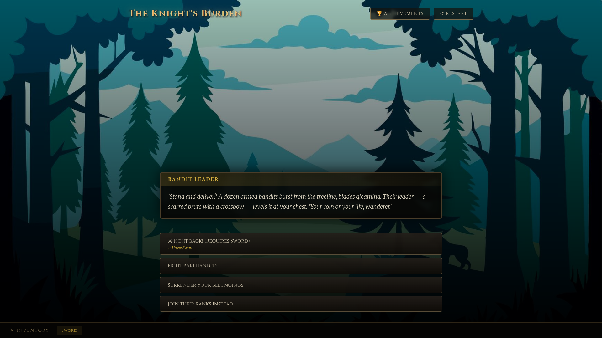

# The Knight's Burden — Interactive Story Game v2.0

A medieval fantasy interactive visual novel game built with **HTML, CSS, and Vanilla JavaScript only**.
Open `index.html` in any modern browser to play.



---

## Live Preview

https://hrant13k.github.io/interactive-story-game--choice-based/

---

## What Was Added in v2

| Feature | Description |
|---|---|
| **VN Dialogue Box** | Character name strip above text, dark styled box at bottom |
| **Scene Crossfade** | Dual-layer background opacity crossfade between scenes |
| **Fade Transition** | Black overlay fades in/out between scenes for cinematic feel |
| **Stagger Animations** | Choice buttons slide up with cascading delay on each scene |
| **Achievement System** | 6 achievements saved in `localStorage`, unlocked by visiting key scenes |
| **Toast Notifications** | Corner popup appears when you unlock an achievement |
| **Achievements Panel** | Click the 🏆 button in the header to view all achievements |
| **Improved Inventory** | Pop-in animation when items are collected |
| **Smooth Restart** | Fade-to-black transition before resetting the game state |

---

## Achievements

Achievements are automatically unlocked when the player visits a specific scene that has an `achievement` field.

| Icon | Name | How to Unlock |
|---|---|---|
| ⚔️ | Well Prepared | Find the sword in the abandoned cart |
| ☮️ | Peacemaker | Listen to the witch instead of attacking |
| 🗡️ | Bandit Slayer | Defeat the bandits using the sword |
| 🔥 | Betrayed the Kingdom | Join the bandit ranks |
| 🛡️ | Loyal Knight | Accept the King's dragon quest |
| 🏆 | Dragon Slayer | Use the key to find Dragonsbane and kill the dragon |

### How achievements are triggered

When a scene is loaded, `script.js` checks for an `achievement` field:

```javascript
if (scene.achievement) {
    const { id, label } = scene.achievement;
    unlockAchievement(id, label); // Saves to localStorage, shows toast
}
```

### How to add a new achievement

**Step 1** — Register it in `ACHIEVEMENT_DEFS` at the top of `script.js`:
```javascript
{ id: 'my_achievement', icon: '🌟', label: 'My Achievement', hint: 'Do something special.' }
```

**Step 2** — Add it to the target scene in `storyData.js`:
```javascript
"my_scene": {
    text: "Something great happened.",
    background: "backgrounds/landscape.webp",
    achievement: { id: 'my_achievement', label: 'My Achievement' },
    choices: [ ... ]
}
```

That's it. The system handles display, toast, persistence, and panel listing automatically.

---

## How to Expand the Game

### Add a New Scene
Add a new key to the `storyData` object in `storyData.js`:

```javascript
"cave_entrance": {
    characterName: "The Narrator",    // shown in name strip (optional)
    text: "You enter the dark cave.", // narrative text
    background: "backgrounds/forest.jpg",
    character: "characters/dragon.webp", // optional portrait
    item: "Torch",                    // optional: adds item to inventory
    achievement: { id: "explorer", label: "The Explorer" }, // optional
    choices: [
        { text: "Go deeper", next: "cave_deep" },
        { text: "Turn back", next: "forest_path" }
    ]
}
```

Then link to it from another scene by setting `next: "cave_entrance"` on a choice.

### Add a New Background
1. Place image in `backgrounds/` (e.g., `cave.jpg`)
2. Reference it: `background: "backgrounds/cave.jpg"`

### Add a New Character Portrait
1. Place a PNG with transparency in `characters/` (e.g., `wizard.png`)
2. Reference it: `character: "characters/wizard.png"`

### Add a New Collectible Item
1. Add `item: "Lantern"` to the discovery scene
2. Gate a choice behind it with `requiredItem: "Lantern"` on the choice object

### Add a Choice Requiring an Item
```javascript
{ text: "Light the darkness", next: "lit_cave", requiredItem: "Lantern" }
```
The button will be disabled with a lock indicator if the player doesn't have the item.